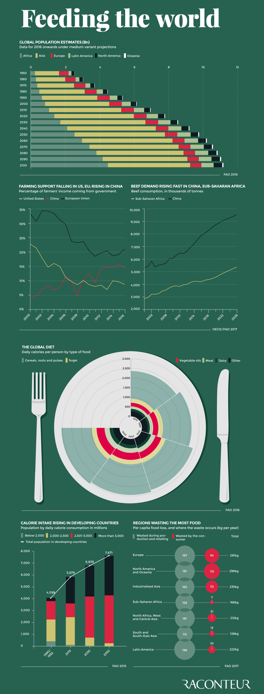

# My report for Assignment 1	😀
## By Shiyun Chang
*7/12/2023*
## Data Viz Summary

####  This image tells about how global population grow in past decades, it shows peoples diet changes, amount of calories that consumed by people, which country waste food the most. It also tells how the rate of agricultural support and meat demand change in the global wide range.
>“Is it clear to a general audience that what they see is the work of professionals who actively shape data to support a cause, and not the product of automated processes?” (Data Feminism, Chapter 3.)
## Data Viz Biography
* **Who or what institution produced the v,isualization? (Hint: refer to "Figure Credits")**

Visual Captalist created this visualization.
* **When was it produced?**

This visualization was produced on November 15, 2017 https://www.visualcapitalist.com/visualizing-rapidly-changing-global-diet/
* **Who is the audience for the visualization?**

I think the audience for this visualization will be people who interested in agricultrual related knowledges.
* **How might the visualization be interpreted or misinterpreted? What consequences might this interpretation/misinterpretation have?**

I think this visulization can give audiences an immediate knowledge about global food. However, it may cause people to think every countries are wasting food, if they don't read carefully. Or, there's a chance that the website made those data, and make people think as the way they want people to think.
* **How, if at all, does the data visualization represent power or systems?**

I don't think this visualization represent official attitudes, or any power or systems. It seems like just a set of data that the website visualcaptalist want to let people know about how global food developed in past and in future.
